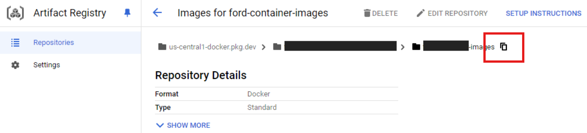

# Cloud Run

[Cloud
Run](https://cloud.google.com/run/docs/overview/what-is-cloud-run) is a
managed compute platform that lets you run containers directly on top of
Google’s scalable infrastructure. You can deploy code written in any
programming language on Cloud Run if you can build a container image
from it. In short, Cloud Run allows developers to spend their time
writing their code, and very little time operating, configuring, and
scaling their Cloud Run service. You don’t have to create a cluster or
manage infrastructure in order to be productive with Cloud Run.

In this tutorial, you will learn how to schedule a job to execute a
Python script on GCP (similar to scheduling queries in BigQuery):

- Required files:
  - `main.py`: a Python application
  - `requirements.txt`: a recipe to create the Python environment
  - `Containerfile`: a recipe to create a container
- Tools:
  - `podman`: to create a container of the Python script and its
    dependencies
  - `gcloud`: to interact with Google Cloud Platform

Sources:

- [What is Cloud
  Run](https://cloud.google.com/run/docs/overview/what-is-cloud-run)
- [Creat jobs](https://cloud.google.com/run/docs/create-jobs#gcloud)
- [Execute jobs on a
  schedule](https://cloud.google.com/run/docs/execute/jobs-on-schedule#command-line)
- [Cron job format and time
  zone](https://cloud.google.com/scheduler/docs/configuring/cron-job-schedules)
- [Configure
  secrets](https://cloud.google.com/run/docs/configuring/jobs/secrets#gcloud)
- [Quickstart: Build and deploy a Python web app to Cloud
  Run](https://cloud.google.com/run/docs/quickstarts/build-and-deploy/deploy-python-service)
- [Getting Started with Podman](https://podman.io/docs)

------------------------------------------------------------------------

## Requirements

To create a container, you need a `Containerfile`. You can generate one
using the Nano text editor by running:

``` sh
# Make a new directory
mkdir cloud-run-demo

# Go to the new directory
cd cloud-run-demo

# Make a Containerfile
nano Containerfile
```

Next, copy the following into the `Containerfile` (this is just an
example; feel free to customize it as needed):

``` containerfile
# Use Python slim image from Docker Hub
FROM python:3.13.2-slim

# Set the working directory within the container
WORKDIR /app

# Copy requirements.txt first for efficient caching
COPY requirements.txt .

# Install dependencies
RUN pip install --no-cache-dir -r requirements.txt

# Copy the application code
COPY main.py .

# Set the entrypoint for the container (the command that runs when the container starts)
CMD ["python", "main.py"]
```

Press `Ctrl + X`, then `Y`, then `Enter` to write the file and exit.

We also need a `requirements.txt` file to list the required packages.
Use the nano text editor to create it:

``` sh
nano requirements.txt
```

Copy the following into the `requirements.txt` file (this is just an
example; be sure to list the specific dependencies for your Python
application):

``` txt
pandas
pandas-gbq
```

Press `Ctrl + X`, then `Y`, then `Enter` to write the file and exit.

Finally, we need to add our Python code. As an example, create a
`main.py` file using nano by running `nano main.py`, then copy the
following code into the file:

``` py
from google.cloud import bigquery
import pandas_gbq

client = bigquery.Client()

sql = """
SELECT * FROM bigquery-public-data.ml_datasets.penguins
WHERE  body_mass_g < 3500 AND sex = 'FEMALE'
"""

df = client.query(sql).to_dataframe()
df.to_gbq('BQ_Tutorial.penguins_data', if_exists='replace')
```

Press `Ctrl + X`, then `Y`, then `Enter` to write the file and exit.

## Build the Container and push it to GCP

First, locate the destination for your container in [GCP Artifact
Registry](https://console.cloud.google.com/artifacts) and copy the
repository path:

<p align="center">


</p>

The path should be like:
`<region>-docker.pkg.dev/<project-id>/<images-directory>`.

To build the container using `podman`, execute the following command:

``` sh
podman build -t <container-path>/<app-name>:<tag> .
```

The `app-name` must use only lowercase alphanumeric characters and
dashes, cannot begin or end with a dash, and cannot be longer than 63
characters. For instance, for my project ID, path, and app ID the
command will look like this:

``` sh
podman build -t us-central1-docker.pkg.dev/proj-58536f721/container-images/pandas-app:1.0-demo .
```

Before pushing the container to GCP Artifact Registry, you need to log
in to your GCP account. Run the following command to authenticate:

``` bash
gcloud auth login
```

Then, configure authentication for the Artifact Registry:

``` bash
gcloud auth configure-docker <region>-docker.pkg.dev
```

Replace `<region>` with your GCP region (e.g., `us-central1`).

Now, use `podman` to push the container to GCP Artifact Registry by
running the following command:

``` sh
podman push <container-path>/<app-name>:<tag>
```

Replace `<container-path>/<app-name>:<tag>` with the actual image path,
name, and tag, which will look something like:

``` sh
podman push us-central1-docker.pkg.dev/proj-58536f721/container-images/pandas-app:1.0-demo
```

## Running a Cloud Run job

To run the Cloud Run job, first set the project ID and then execute the
following command:

``` sh
# Set project ID
gcloud config set project <project-id>
```

After setting the project ID, run the Cloud Run job using:

``` sh
# Create the job
gcloud run jobs create <job-name> \
       --image <container-path>/<app-name>:<tag> \
       --region <region>
```

Some other options that can be added are:

``` sh
--cup # set number of cpus (default 1)
--memory # set memory limit. Ex: 2G, 256M (default 512M)
--max-retries # Number of times a task is allowed to restart in case of failure (default 3) 
--service-aacount # Specify the service account associated with the service
--set-env-vars # List of key-value pairs to set as environment variables. Ex: --set-env-vars ENV=myenv,OTHER_ENV=otherenv
--env-vars-file # Path to a local YAML file with definitions for all environment variables. Example YAML content: KEY_1: "value1"
--set-secrets # Specify secrets to provide as environment variables. Ex: --set-secrets ENV=mysecret:latest,OTHER_ENV=othersecret:1
--vpc-connector # Set a VPC connector for this resource
--vpc-egress all-traffic # Sends all outbound traffic through Direct VPC egress or the VPC connector
```

For a full list of available options when creating a job, refer to the
[gcloud run jobs
create](https://cloud.google.com/sdk/gcloud/reference/run/jobs/create)
command line documentation. After creating the job, we can execute it
by:

``` sh
gcloud run jobs execute <job-name> --region <region>
```

Note that the `job-name` must use only lowercase alphanumeric characters
and dashes, cannot begin or end with a dash, and cannot be longer than
63 characters. For instance:

``` sh
gcloud run jobs create cloud-run-demo \
       --image us-central1-docker.pkg.dev/proj-58536f721/container-images/pandas-app:1.0-demo \
       --region us-central1
```

And execute it by:

``` sh
gcloud run jobs execute cloud-run-demo --region us-central1
```

## Scheduling jobs

To execute a Cloud Run job on a schedule, you can use Cloud Scheduler.
Here’s the command to set up a scheduled job:

``` sh
gcloud scheduler jobs create http <scheduler-job-name> \
  --location <region> \
  --schedule <cron-format> \
  --uri "https://<region>-run.googleapis.com/apis/run.googleapis.com/v1/namespaces/<project-id>/jobs/<job-name>:run" \
  --http-method POST \
  --oauth-service-account-email <service-account>@<project-id>.iam.gserviceaccount.com
```

To update a previously scheduled job, we can run:

``` sh
gcloud scheduler jobs update http <scheduler-job-name> \
  --location <region> \
  --schedule <new-schedule> \
```

And to list all the scheduled jobs in the project, run:

``` sh
gcloud scheduler jobs list --location <region>
```

For instance, to execute the cloud-run-demo job every Monday at noon UTC
(`0 12 * * 1`):

``` sh
gcloud scheduler jobs create http scheduled-cloud-run-demo \
  --location us-central1 \
  --schedule "0 12 * * 1" \
  --uri "https://us-central1-run.googleapis.com/apis/run.googleapis.com/v1/namespaces/proj-58536f721/jobs/cloud-run-demo:run" \
  --http-method POST
```

After creating the Cloud Scheduler job, you can verify its configuration
and see when it’s next scheduled to run using the following command:

``` sh
gcloud scheduler jobs describe scheduled-cloud-run-demo --location us-central1
```

## Managing secrets

📙 **Important note:** Never hard-code your credentials and secrets in
your code, and avoid committing them to version control or including
them in containers.

The best practice for managing credentials in GCP is to store them in
the Secret Manager and pass them to the container as environment
variables. To create a secret, run:

``` sh
gcloud secrets create <secret-name> --replication-policy "automatic"
```

To add the a secret to it, run:

``` sh
gcloud secrets versions add <secret-name> --data-file /path/to/secret/file
```

For instance:

``` sh
# To create the secret
gcloud secrets create cloud-run-demo-secret --replication-policy "automatic"

# Add a secret
gcloud secrets versions add cloud-run-demo-secret --data-file demo-secret.txt

# List secrets
gcloud secrets list
```

We can provide credentials to the Cloud Run job by using the
`--set-secrets DEMO_SC=cloud-run-demo-secret:latest` option when
creating the job.

## Clean up

To remove the demo container image from the Artifact Registry, you can
run:

``` sh
gcloud container images delete <container-path>/<app-name>:<tag>
```

To remove the Cloud Run job, run:

``` sh
gcloud run jobs delete <job-name> --region <region>
```

To remove the scheduler, run:

``` sh
gcloud scheduler jobs delete <scheduler-job-name> --location <region>
```

And to remove the secret, run:

``` sh
gcloud secrets delete <secret-name>
```

For instance:

``` sh
# Delete the image
gcloud container images delete us-central1-docker.pkg.dev/proj-58536f721/container-images/pandas-app:1.0-demo

# Delete the job
gcloud run jobs delete cloud-run-demo --region us-central1

# Delete the scheduler
gcloud scheduler jobs delete scheduled-cloud-run-demo --location us-central1

# Delete the secret
gcloud secrets delete cloud-run-demo-secret
```

---

Copyright, [Ashkan Mirzaee](https://ashki23.github.io/index.html) | Content is available under [CC BY-SA 3.0](https://creativecommons.org/licenses/by-sa/3.0/) | Sourcecode licensed under [GPL-3.0](https://www.gnu.org/licenses/gpl-3.0.en.html)
