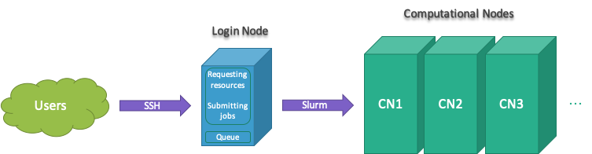
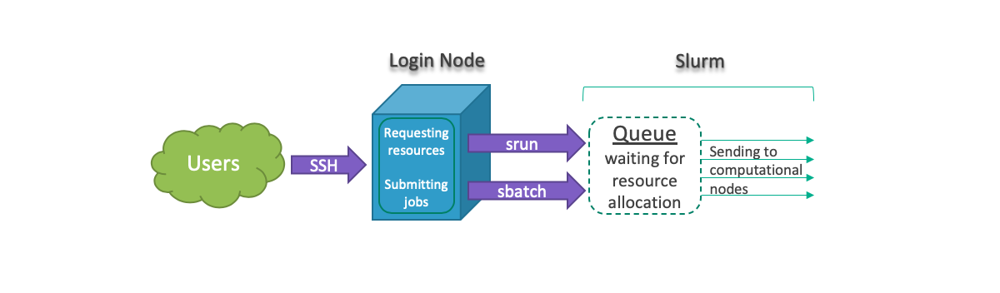

# Introduction to using clusters
*[Ashkan Mirzaee](https://ashki23.github.io/index.html)*

This page discribes several ways to manage resources and also submit and
monitor jobs in a high performance computing (HPC) environment.

  - Training presentation
    ([pdf](http://docs.rnet.missouri.edu/files/hpc-intro.pdf))

**Prerequisite:** for better understanding of this course, users are
expected to know a basic knowledge about Linux (Unix Shell) and terminal
text editors. You can review:

  - [The Unix Shell](https://ashki23.github.io/shell.html)
  - [Software Carpentry
    workshop](http://swcarpentry.github.io/shell-novice/)

-----

## Clusters

A cluster or supercomputer is a computer with a high level of
performance as compared to a general-purpose computer. They have built
for the purpose of massive parallelization to decrease computation time
and get results faster. Each cluster consists of several components. The
smallest element in a cluster is Processing Element (PE) that can be
compared with personal computers’ cores. Tens of PEs create a
Computational Node and hundreds of Nodes create a Partition, and finally
putting Partitions together will create a cluster. Following shows
hierarchy of a cluster.

<p align="center">


<div style="text-align: center; font-size: 85%;">

From
[wikipedia](http://en.wikipedia.org/wiki/Image:LLNL_BGL_Diagram.png)

</div>

</p>

## Slurm

[Slurm](https://slurm.schedmd.com) is an open source and highly scalable
cluster management and job scheduling system for large and small Linux
clusters. As a cluster workload manager, Slurm has three key functions.

  - First, it allocates access to resources (compute nodes) to users for
    some duration of time so they can perform work
  - Second, it provides a framework for starting, executing, and
    monitoring work (normally a parallel job) on the set of allocated
    nodes
  - Finally, it arbitrates contention for resources by managing a queue
    of pending work (from [Slurm
    overview](https://slurm.schedmd.com/overview.html))

## Login Node

Users connect to clusters through the login nodes.

<p align="center">



</p>

<br />

All jobs must be run using Slurm submitting tools to prevent running on
the login node.

## Cluster Information

Slurm is a resource management system and has many tools to find
available resources in the cluster. Following are set of Slurm commands
for that purpose:

``` bash
sinfo –s # summary of cluster resources (-s --summarize)
sinfo -p <partitoion-name> -o %n,%C,%m,%z # compute info of nodes in a partition (-o --format)
sinfo -p Gpu -o %n,%C,%m,%G # GPUs information in Gpu partition (-p --partition)
sjstat –c # show computing resources per node
scontrol show partition <partition-name> # partition information
scontrol show node <node-name> # node information
sacctmgr show qos format=name,maxwall,maxsubmit # show quality of services
```

For example the following shows output for `sinfo -s` and `sjstat -c`
commands:

    [user@cluster-login-node ~]$ sinfo -s 
    PARTITION AVAIL  TIMELIMIT   NODES(A/I/O/T)  NODELIST
    hpc          up 2-00:00:00          0/4/0/4  cluster-hpc1-node[908-911]
    Interact     up 2-00:00:00          0/4/0/4  cluster-hpc2-node[908-911]
    General*     up    2:00:00          0/4/0/4  cluster-hpc3-node[908-911]
    
    [user@cluster-login-node ~]$ sjstat -c
    Scheduling pool data:
    -------------------------------------------------------------
    Pool        Memory  Cpus  Total Usable   Free  Other Traits
    -------------------------------------------------------------
    hpc        122534Mb    24      4      4      4
    Interact   122534Mb    24      4      4      4
    General*   122534Mb    24      4      4      4

For instance above `sinfo -s` shows partition hpc3 has 4 idle nodes
(free) and users can run jobs up 2 days. And, `sjstat -c` shows that
partion hpc3 has 4 nodes with 24 cpus and 122GB of memory on each node.
In general, `CPUS/NODES(A/I/O/T)` count of CPUs/nodes in the form
“available/idle/other/total” and `S:C:T` counts number of “sockets,
cores, threads”.

## Users Information

Users can use Slurm to find more informations about their accounts,
fairshare and quality of services (QOS) and several Unix commands to
find their storage quotas.

``` bash
sshare -U # show your fairshare and accounts (-U --Users)
sacctmgr show assoc user=$USER format=acc,user,share,qos,maxj # your QOS 
groups # show your groups
df -h /home/$USER home # storage quota (-h --human-readable)
```

## Job Submission

All jobs must be run using `srun` or `sbatch` to prevent running on the
Cluster login node. In general, users can request resources and run
tasks interactively or create a batch file and submit their jobs. The
following graphs shows job submission workflow:

<p align="center">



</p>

For running jobs interactively, we can use `srun` to request required
resources through Slurm and run jobs interactively. For instance:

``` bash
srun <slurm-options> <software-name/path>
srun --pty /bin/bash # requesting a pseudo terminal of bash shell to run jobs interactively
srun -p Interactive --pty /bin/bash # requesting a p.t. of bash shell on patition called Interactive (-p --partition)
srun -p <partition-name> -n 4 --mem 16G --pty /bin/bash # req. 4 tasks and 16G memory (-n --ntasks)
srun -p Gpu --gres gpu:1 -N 1 --ntasks-per-node 8 --pty /bin/bash # req. 1 GPU and 1 node for running 8 tasks on Gpu partition (-N --nodes)
```

For submitting jobs, we can create a batch file, which is a shell script
(`#!/bin/bash`) including Slurm options (`#SBATCH`) and computational
tasks, and use:

``` bash
sbatch <batch-file> 
```

After job completion we will receive outputs i.e. `slurm-jobid.out`.

Slurm has several options that help users manage their jobs requirement,
such that:

``` bash
-p --partition <partition-name>       --pty <software-name/path>
--mem <memory>                        --gres <general-resources>
-n --ntasks <number of tasks>         -t --time <days-hours:minutes>
-N --nodes <number-of-nodes>          -A --account <account>
-c --cpus-per-task <number-of-cpus>   -L --licenses <license>
-w --nodelist <list-of-node-names>    -J --job-name <jobname>
```

Also, Slurm has several environmental variables that contain details
such as job id, job name, host name and more. For instance:

``` bash
$SLURM_JOB_ID
$SLURM_JOB_NAME
$SLURM_JOB_NODELIST
$SLURM_CPUS_ON_NODE
$SLURM_SUBMIT_HOST
$SLURM_SUBMIT_DIR
```

For example let’s consider the following Python code, called `test.py`:

``` python
#!/usr/bin/python3
import os

os.system("""
echo hostname: $(hostname)
echo number of processors: $(nproc)
echo data: $(date)
echo job id: $SLURM_JOB_ID
echo submit dir: $SLURM_SUBMIT_DIR
""")

print("Hello world”)
```

To run the above code, we can use `srun` to run `test.py` interactively
on a partition called Interactive such that:

    srun -p Interactive -n 4 --mem 8G --pty bash
    
    python3 test.py

Or create a batch file, called `jobpy.sh`, such that:

``` bash
#!/bin/bash

#SBATCH -p Interactive
#SBATCH -n 4
#SBATCH --mem 8G

python3 test.py 
```

And use `sbatch` to submit the batch file:

``` bash
sbatch jobpy.sh
```

## Monitoring Jobs

The following Slurm commands can be used to monitor jobs:

``` bash
sacct -X # show your jobs in the last 24 hours (-X --allocations)
sacct -X -S <yyyy-mm-dd> # show your jobs since a date (-S --starttime)
sacct -X -S <yyyy-mm-dd> -E <yyyy-mm-dd> -s <R/PD/F/CA/CG/CD> # show running/pending/failed/cancelled/completing/completed jobs in a preiod of time (-s --state)
sacct -j <jobid> # show more details on selected jobs (-j --jobs)
squeue -u <username> # show a user jobs (R/PD/CD) in the queue (-u --user)
squeue -u <username> --start # show estimation time to start pending jobs
scancel <jobid> # cancel jobs
```

## Monitor CPU and Memory

**Compeleted jobs**

We can use the following options to check how many resouces is consumed
by a competed job.

``` bash
sacct -j <jobid> -o User,Acc,AllocCPUS,Elaps,CPUTime,TotalCPU,AveDiskRead,AveDiskWrite,ReqMem,MaxRSS # info about CPU and virtual memory for compeleted jobs (-j --jobs)
seff <jobid> # show job CPU and memory efficiency 
```

For more information on what fields to include see `man sacct`.

Example output:

``` bash
[user@cluster-login-node675 ~]$ sacct -j 10785018 -o User,Acc,AllocCPUS,Elaps,CPUTime,TotalCPU,ReqMem,MaxRSS
     User    Account  AllocCPUS    Elapsed    CPUTime   TotalCPU     ReqMem     MaxRSS 
--------- ---------- ---------- ---------- ---------- ---------- ---------- ---------- 
     user    general         16   00:48:39   12:58:24  01:49.774       64Gn       216K 

[user@cluster-login-node ~]$ seff 10785018
Job ID: 10785018
Cluster: cluster4
User/Group: user/rcss
State: COMPLETED (exit code 0)
Nodes: 1
Cores per node: 16
CPU Utilized: 00:01:50
CPU Efficiency: 0.24% of 12:58:24 core-walltime
Memory Utilized: 3.38 MB (estimated maximum)
Memory Efficiency: 0.01% of 64.00 GB (64.00 GB/node)
```

**Running jobs**

Slurm provides a tool to monitor running jobs. In order for this to work
jobs using SBATCH must utilize the `srun` command within the job file.

``` bash
sstat <jobid> -o AveCPU,AveDiskRead,AveDiskWrite,MaxRSS # info about CPU and memory for runing jobs (srun only)
```

Also, we can use `top` command to find how much CPU and memory are using
by a submited job. To do that, we need to attach to the nodes that our
job is running and run `top` command.

``` bash
srun --jobid <jobid> --pty /bin/bash 

top -u $USER
```

For Memory usage, the number you are interested in is RES. In case
below, python3 program is using about 5.6Mb memory and 0% of the
requested CPUs.

``` bash
  PID USER     PR  NI    VIRT    RES    SHR S  %CPU %MEM     TIME+ COMMAND
14278 Buzz     20   0  124924   5612   2600 S   0.0  0.0   0:00.04 python3
14279 Buzz     20   0  124924   5612   2600 S   0.0  0.0   0:00.03 python3
```

## Modules

In order to use a software, we need to load the coresponding module
firts. The following commands let us mange modules in our workflow:

``` bash
module avail # available modules
module show # show modules info 
module list # list loaded modules
module load # loaded modules
module unload # unload loaded modules
module purge # unload all loaded modules
```

**Never load modules in the login node**. It makes login node slow for
all users and many modules don’t work in the login node.

For example to use R interactively, first need to request resources on a
partition called Interactive by `srun` and then use `module load R`:

``` bash
srun -p Interactive --mem 4G --pty /bin/bash
module load R
R
```

If you are looking for using a licenced software (available in cluster)
make sure you call the licence when requesting resources. For instance
to use MATLAB:

``` bash
srun -p Interactive --mem 4G -L matlab --pty /bin/bash
module load matlab
matlab -nodisplay
```

-----

## More Resources

  - [RCSS Documentation](http://docs.rnet.missouri.edu)
  - [XSEDE Training](https://www.xsede.org/for-users/training)
  - [Software Carpentry](https://software-carpentry.org/lessons/)
  - [HPC Carpentry](https://hpc-carpentry.github.io)
  - [Data Carpentry](https://datacarpentry.org/lessons/)
  - [Cornell Virtual Workshop](https://cvw.cac.cornell.edu/topics)
  - [Pittsburgh Supercomputing Center
    (PSC)](https://www.psc.edu/resources-for-users/training/)
  - [TACC Learning Portal](https://learn.tacc.utexas.edu/course/)

---

Copyright 2018-2019, [Ashkan Mirzaee](https://ashki23.github.io/index.html) | Content is available under [CC BY-SA 3.0](https://creativecommons.org/licenses/by-sa/3.0/) | Sourcecode licensed under [GPL-3.0](https://www.gnu.org/licenses/gpl-3.0.en.html)
